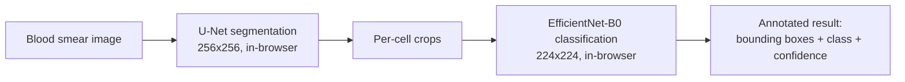

# HemaLens

**Offline, in-browser red blood cell morphology classification — built for UnivaBio (BioCatalysis × UnivaDev), Devpost.**


## The problem

Diagnosing conditions like Sickle Cell Disease, Thalassemia, and various anemias depends on recognizing red blood cell morphology under a microscope — a skill that takes years to train, and isn't available at the point of care in many rural clinics. In remote and low-resource regions, there's a severe shortage of trained hematologists able to do this manually.

## What it does

HemaLens classifies red blood cells into **13 morphological classes** directly from a blood smear image — entirely in the browser, with **no server-side inference and no internet connection required** after the page first loads. A two-stage pipeline (cell segmentation → per-cell classification) runs client-side via ONNX Runtime Web, so no patient image data ever leaves the device.

| | |
|---|---|
| **Classes detected** | Normal, Macrocyte, Microcyte, Spherocyte, Target Cell, Stomatocyte, Ovalocyte, Teardrop, Burr Cell, Schistocyte, Uncategorised, Hypochromia, Elliptocyte |
| **Dataset** | [Chula-RBC-12](https://github.com/Chula-PIC-Lab/Chula-RBC-12-Dataset) — 623 labeled smear images, 22,106 labeled cells, ~34:1 class imbalance |
| **Classifier performance** | EfficientNet-B0, Focal Loss — **0.857 macro F1** on held-out validation data |
| **Segmentation** | MONAI U-Net, weakly-supervised on point-annotation pseudo-masks — IoU ~0.26 (see *Honest limitations* below) |

## Architecture



Both models are exported to ONNX and run client-side via `onnxruntime-web` (WASM execution provider) — no backend inference server, no image upload to any API.

## Repo layout

- **`ml/`** — data pipeline, model training (segmentation + classification), ONNX export. See [`ml/README.md`](ml/README.md).
- **`web/`** — the React app that loads the exported ONNX models and runs inference in-browser. See [`web/README.md`](web/README.md).
- **`docs/`** — [full PRD](docs/PRD.md) and project background.
- **`ml/MODEL_IO.md`** — the exact tensor shapes/preprocessing contract between the ML and web sides, auto-generated at export time.

## Quick start

**Run the web app** (uses the already-exported, already-trained models committed in this repo):
```bash
cd web
npm install
npm run dev
```

**Retrain from scratch** (optional — not required to run the app):
```bash
cd ml
bash download_dataset.sh
python src/data_prep.py
python src/segmentation/train_unet.py
python src/classification/train_efficientnet.py
python src/export/export_onnx.py
```
Full details and expected runtimes in [`ml/README.md`](ml/README.md). We trained on Kaggle's free GPU tier — see that README for the exact notebook flow.

## Honest limitations

We'd rather state these plainly than have a judge find them first:

- **Segmentation quality is weak (IoU ~0.26).** Chula-RBC-12 ships point annotations only, not true segmentation masks — we generate pseudo-masks (fixed-radius circles) as weak supervision. This means cell detection is approximate, especially for tightly touching cells. The classifier, trained on the dataset's real per-cell crops, is substantially stronger than the segmentation stage.
- **This is a morphology classifier, not a diagnostic tool.** It identifies cell shape categories (e.g. "Target Cell"); it does not diagnose disease. Clinical interpretation of what a given morphology pattern indicates requires a qualified professional.
- **Not validated on a clinical population or device pipeline** — trained and evaluated entirely on the public Chula-RBC-12 dataset.

## Team

- **Robiu Olalere** ([@Algebra329](https://github.com/Algebra329)) — ML architecture, model training, data pipeline. Final-year CS, University of Ilorin, Nigeria.
- **Abdul-Salaam Ibraheem** — web app, deployment, infrastructure.

## License

[Add a license — MIT is a reasonable default for a hackathon submission if the team hasn't decided.]